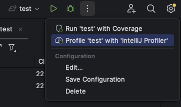
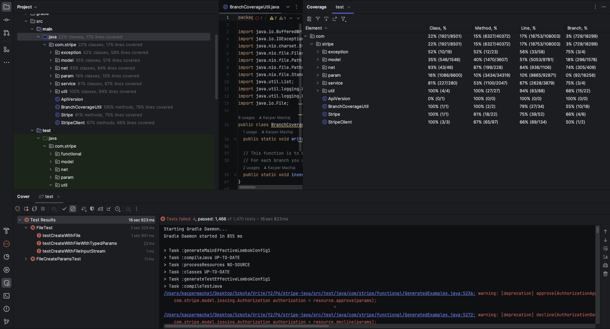
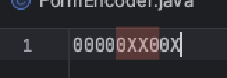
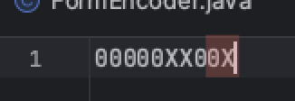
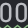
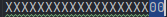
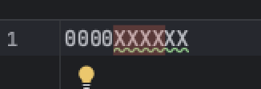
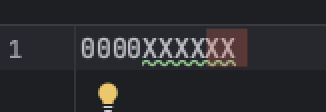
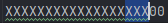
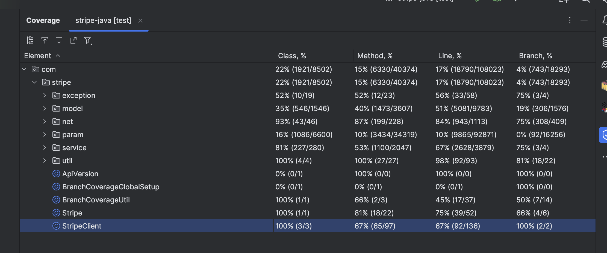

# Report for Assignment 1

## Project chosen

Name: stripe-java

URL: [stripe-java link](https://github.com/stripe/stripe-java)

Number of lines of code and the tool used to count it: 314 836 - Statistic plugin for Intellij IDEA

Programming language: Java

## Coverage measurement

### Existing tool

Since the project was written in Java we decided to use the built-in coverage tool of Intellij IDEA IDE in order to get the branch coverage. IDEA allowed us to run the project’s JUNIT test framework by simply running the “test” configuration in gradle with coverage.

The “test” gradle configuration runs all of the tests that are part of the test directory of the repository.

This is how IDEA displays the branch coverage after running the gradle “test” configuration:

### Your own coverage tool

#### Raul Steurer

Diff where I added the coverage tool: [Original Repo](https://github.com/raulsteurer/stripe-java/commit/80c5b5c7b4126188aae8e8636e3552ffc5770c54)

##### ApiResource.urlEncode():

This method has 4 branches, but only 2 of them are covered in the original state.

##### ApiResource.setExpandableFieldId():

This method has 2 branches, but only 1 of them is covered in the original state.

#### Kacper Machaj

[Link to Own Coverage Tool](https://github.com/stripe/stripe-java/commit/03ff0b4f5325740ec93c7756a4e85ea7d08980bb)

##### CaseInsensitiveMap.get()

Our branch coverage measurement tool initially creates a file filled with 0’s. Whenever a branch with UID = n is executed (of course only inside our chosen functions) the 0 at nth place in the is replaced by an X. My function has 2 branches and only one of the branches was reached through the existing tests. Hence one 0 one X.

##### StripeClient.buildOptions()

This function also has 2 branches and only one is initially reached.

#### Emre Cebi

[Link to Own Coverage Tool](https://github.com/raulsteurer/stripe-java/commit/e913127b1af524bdc9835e830827ae283295feff)

##### CaseInsensitiveMap.remove()

##### CaseInsensitiveMap.convertKey()

#### Egor Kolesov

[Link to Own Coverage Tool](https://github.com/raulsteurer/stripe-java/pull/6/commits/6b0a2686221d976380abfbac63371a5d700c2c3e)

##### SetAccountTaxIds

##### SetAccountTaxIdObjects

## Coverage improvement

### Individual tests

#### Raul Steurer

[Link to diff where I added the new test cases](https://github.com/raulsteurer/stripe-java/commit/46eeb5b10a3e6bc7f7f6e0e171c7b38dadc6fe2b)

##### ApiResource.urlEncode():

Old Coverage:

New Coverage:

I improved coverage by asserting that the methods work correctly when they are called with a null pointer. I have also added tests that assert that the correct type of error gets thrown when UrlEncode fails.
I improved branch coverage to 100%

##### ApiResource.setExpandableFieldId():

Old Coverage:

New Coverage:

I test that the function works as expected when called with a null pointer.
I improved branch coverage to 100%

#### Kacper Machaj

##### testGetNullKey

[Kacper Test 1](https://github.com/stripe/stripe-java/commit/4af799bbd83d270268251dceac5617125e700e7d
)

Old coverage:

New coverage:

That test improves the branch coverage for the getKey() method from 50% to 100%. This function has two branches and initially only one of them was tested. My test tests the previously untested branch.

##### testBuildClientOptionsWithNullApiKey

[Kacper Test 2](https://github.com/stripe/stripe-java/commit/9eca2abf96c6a18f5958acf5a7ae152a9a2c4161
)

Old coverage:

New coverage:

That test improves the branch coverage for the buildOptions() method from 50% to 100%. This function has two branches and initially only one of them was tested. My test tests the previously untested branch.

#### Emre Cebi

[Link to Improvement Commit](https://github.com/raulsteurer/stripe-java/commit/e913127b1af524bdc9835e830827ae283295feff)

##### TestRemoveNull

Old coverage:

New coverage:

For the first one I added a simple null value test to check how the function behaves when a null key is removed. This increased the test coverage from 80% to 90%
##### TestConvertKey

Old coverage:

New coverage:

For the second test as the tested function is a private function it cannot be called directly so I used an assetsThrowsExacly method to catch the error the function throws called IllegalArgumentException. In this test inside the asset method I create a new CaseInsensitiveMap with no type declaration and try to remove the illegal key “1”. As all keys need to be string or null and all functions call the ConvertKey function to convert the key into a case insensitive one this archives the desired effect.

With the addition of the final test, the branch coverage of CaseInsensitiveMap is increased to 100%.

#### Egor Kolesov

[Link to Improvement Commit](https://github.com/raulsteurer/stripe-java/pull/6/commits/6b0a2686221d976380abfbac63371a5d700c2c3e)

##### SetAccountTaxIds

Old coverage:

New coverage:

The coverage for the function improved from 0 to 100% (not possible to display numerically for individual methods via the IntelliJ coverage tool), total branch coverage for the class improved from 18% to 25% as seen on the screenshots above. The coverage improved because additional tests for all possible branches in the method were introduced.

##### SetAccountTaxIdObjects

Old coverage:

New coverage:

The coverage for the function improved from 0 to 100% (not possible to display numerically for individual methods via the IntelliJ coverage tool, has to be looked at manually), total branch coverage for the class improved from 18% to 21% as seen on the screenshots above. The coverage improved because additional tests for all possible branches in the method were introduced.

### Overall

Overall we were able to detect some important areas in this repository that was not covered by branch testing and improve upon them.

Old Coverage (Existing Tool):

New Coverage (Existing Tool):

## Statement of individual contributions

### Raul Steurer

I checked dozens of projects to see if they are suitable for our
assignment. I then set up the git repo.

### Emre Cebi

Other than our individual tasks in this assignment I also helped with writing and formating the report and organised the repository.

### Kacper Machaj

I have created our own branch coverage tool. In order to do so I created a branchCoverageUtil file and also changed the build.gradle file to run a static method of my class by using Java reflections. I also wrote tests that checks what will getKey(null) as well as buildOptions(null) return. By doing that I have increased the branch coverage for both of these functions to 100%. 

### Egor Kolesov

 I have created 5 additional tests and extended coverage to 100% for two methods of the Invoice class, specifically SetAccountTaxIds and SetAccountTaxIdObjects. I additionally changed the setup process for our branch coverage tool to correctly work on Windows.
